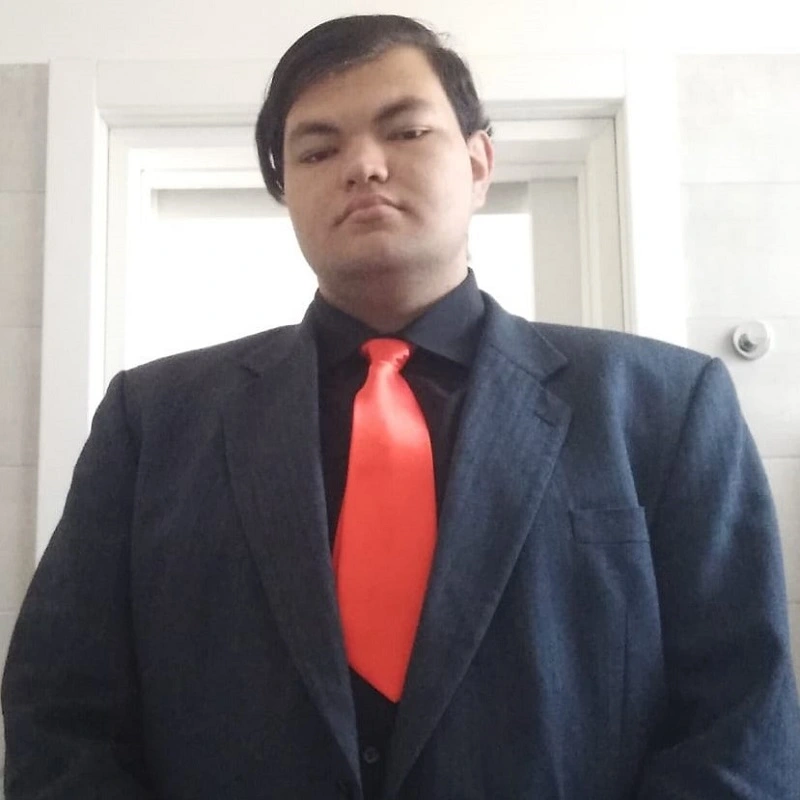

## Who I am

Hello, I'm Andrei Anghi, a full-stack programmer specializing in web development.
I am highly motivated, with a strong problem-solving attitude and always seeking new challenges.
Thanks to my experience, I can handle any project independently, respecting the requirements and deadlines.
Moreover, I am recognized as an excellent collaborator, appreciated for my ability to work in a team.
Currently, I am 20 years old.
I speak Italian fluently and have a good command of English and Romanian. My journey into the world of computing began on October 26, 2019, experimenting with Batch. I started sharing the world of computing on social media on September 7, 2022.
I obtained my diploma from IIS Ulderico Midossi in the ITT computer science program with a score of 80 out of 100. Currently, I am pursuing my studies at the University 42 Roma Lius.
My goal: Code a better future.

***

## Work and Projects
- [42RomaLuis](https://github.com/AnghiAndrei/42RomaLuis)
- [to-do-list](https://github.com/AnghiAndrei/to-do-list)
- [Formula_previsione_ingressi_ai_siti_web](https://github.com/AnghiAndrei/Formula_previsione_ingressi_ai_siti_web)

***

## Contact Me

| :----:           | :----:                       |
| Email:           | andrei.anghi.angly@gmail.com |
| Tiktok:          | andreianghi                  |
| Youtube:         | Andrei Anghi                 |
| Instagram:       | andrei_anghi                 |
| Youtube gaming:  | andrei anghi gaming          |
| Twitter:         | AndreiAnghi                  |
| Linkedin:        | Andrei Anghi                 |
| Discord:         | Andrei Anghi                 |
| Portfolio:       | andreianghi.ddns.net         |
